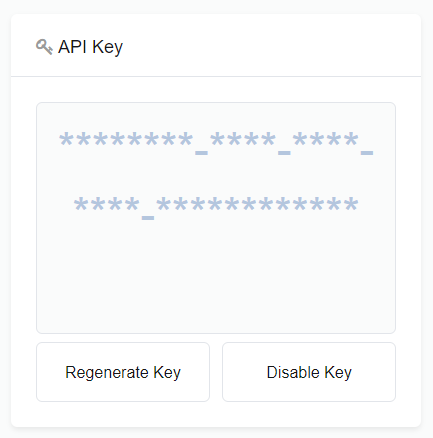
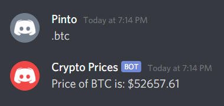

# DiscordCryptocurrencyBot
This Discord bot gives the latest prices for any cryptocurrency listed on Coinmarketcap.com.
The bot scans for the period symbol then searches for the cryptocurrency symbol given by the user. (I used, replit.com an online IDE to, run the Discord bot.)

## Requirements/Steps
You will need to create an account with the [Coinmarketcap developer's site](https://coinmarketcap.com/api/) and then retrieve your API Key from your account. This API Key is what **my_secret2** represents in the program.

Secondly, you will need to sign in to [Discord Developer Portal](https://discord.com/developers/applications), and create a new application, then click on the bot tab. You will see the token key for that which you retrieve. This Token key is what **my_secret** represents in the program.

## Input Examples

**.btc** is a valid input.

**.oklp** isn't a valid input.

**.kool** is a valid crypto input, but doesn't have any data listed for it.

